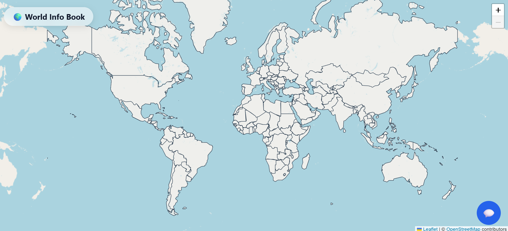
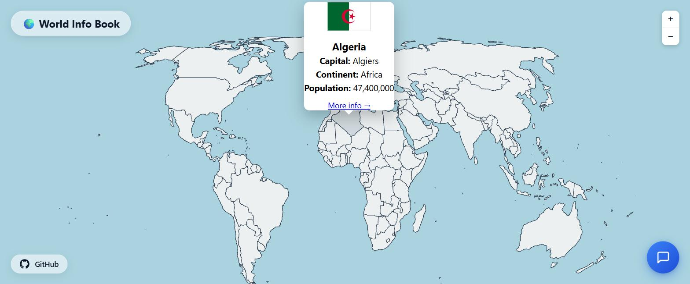
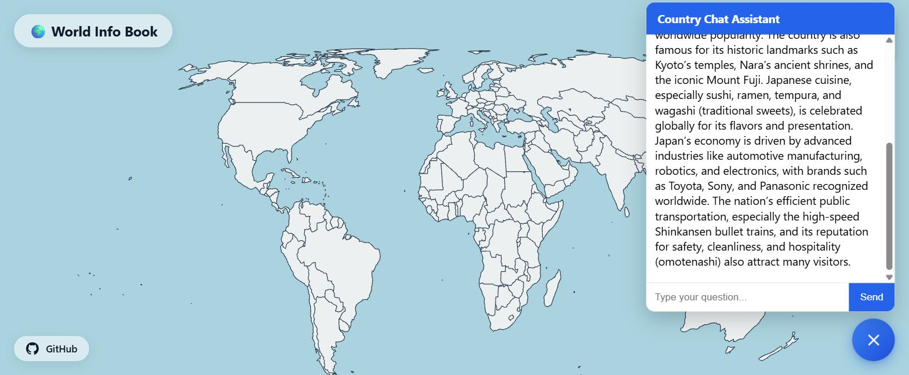
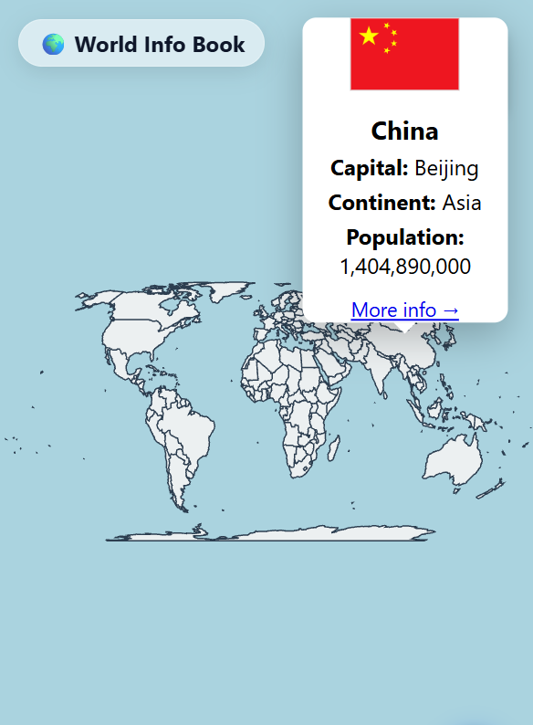

# 🌍 World Info Book

An interactive, AI‑powered world map that lets you explore country data at a glance – and ask questions about any country.



---

## 🚀 Live Demo

**[World Info Book – Live on Vercel](https://world-info-book.vercel.app)**  

---

## 📖 What It Does & The Problem It Solves

**World Info Book** is a full‑screen interactive map that displays key information about every country – population, capital, continent, and flag – directly in popups when you click on a country.

**The problem:** Maps show where countries are, but getting basic facts usually requires a separate search, opening multiple tabs, or remembering which source has the most reliable data.

**The solution:** We’ve eliminated that friction by embedding country data directly into the map, combined with a built‑in AI assistant that answers deeper questions without leaving the page.

**Who it’s for:** Anyone who wants to explore the world – students, travellers, educators, or just the curious – with an intuitive, visual interface.

---

## ✨ Features

- **Interactive world map** – pan, zoom, and click any country.
- **Detailed country popups** – show flag, capital, continent, and population (formatted with commas).
- **Britannica integration** – “More info” link searches Britannica for the country.
- **AI chatbot assistant** – ask questions about any country; get real‑time, streaming answers.
- **Glass‑morphism UI** – a sleek, translucent title badge and responsive design.
- **Globe favicon** – a simple emoji‑based icon for your browser tab.
- **Full‑screen, immersive map** – with Leaflet and OpenStreetMap tiles.
- **Responsive design** – works beautifully on desktop, tablet, and mobile.

---

## 🤖 AI Chatbot Integration

The chatbot is a custom AI assistant built to answer country‑related questions. It can provide historical context, cultural insights, demographic details, and more.

### Basic System Prompt (what the AI is instructed to do)
```text
You are a helpful country facts assistant. Respond in clear, plain text. Do not use Markdown, asterisks, underscores, or hashes for formatting. Use simple line breaks to separate paragraphs.
```

### How it works
1. User types a question in the chat panel.
2. The question is sent to the backend (`/api/chat`).
3. The backend calls the **Groq API** (using the `openai/gpt-oss-120b` model).
4. The AI generates a response in plain text.
5. The response streams back to the frontend in real‑time.
6. The user sees the response appear word‑by‑word.

---

## 🛠️ Tools, Services & AI Models

| Category | Technology |
|----------|------------|
| **Map** | [Leaflet](https://leafletjs.com/) + [OpenStreetMap](https://www.openstreetmap.org/) tiles |
| **Country Data** | [REST Countries API v5](https://restcountries.com/) |
| **AI Chat** | [Groq](https://groq.com/) (model: `openai/gpt-oss-120b`) |
| **Hosting & Serverless** | [Vercel](https://vercel.com/) |
| **Fonts** | System UI stack (no external fonts) |
| **GeoJSON Data** | [johan/world.geo.json](https://raw.githubusercontent.com/johan/world.geo.json/master/countries.geo.json) |
| **Favicon** | Emoji‑based SVG data URI |
| **Version Control** | Git + GitHub |

---

## 📸 The App in Action - Screenshots







---

## 🏁 How to Run the Project

### Prerequisites
- [Node.js](https://nodejs.org/) (v16 or later)
- A [Vercel](https://vercel.com/) account (free tier is fine)
- API keys for:
  - [REST Countries](https://restcountries.com/sign-up) (free)
  - [Groq](https://console.groq.com/keys) (free)

---

### 1. Clone the Repository
```bash
git clone https://github.com/R21cF/world_info_book.git
cd world-info-book
```

### 2. Set Up Environment Variables
Create a `.env` file in the project root:

```env
REST_COUNTRIES_KEY=your_rest_countries_api_key
GROQ_API_KEY=your_groq_api_key
```

> **Note:** These keys are used by the Vercel serverless functions (`/api/countries.js` and `/api/chat.js`).

### 3. Install Vercel CLI (optional)
If you want to test locally:
```bash
npm install -g vercel
```

### 4. Run Locally
```bash
vercel dev
```

The app will be available at `http://localhost:3000`.

### 5. Deploy to Vercel
```bash
vercel --prod
```

Make sure to add your environment variables in the Vercel dashboard:
- Go to your project → **Settings** → **Environment Variables**.
- Add `REST_COUNTRIES_KEY` and `GROQ_API_KEY` with the values from your `.env` file.
- Select **Production** (and Preview/Development if needed).

---

## 📁 Project Structure

```
world-info-book/
├── index.html          # Main HTML + inline styles/scripts
├── style.css           # Global and map styles
├── script.js           # Map logic, popups, and chat UI
├── api/
│   ├── chat.js         # AI chatbot endpoint (Groq)
│   └── countries.js    # Country data proxy (REST Countries v5)
├── .env                # Environment variables (ignored by Git)
├── .env.local          # Ignored by git as well
└── .gitignore          # For telling Git to ignore files
```

---

## 🙌 Acknowledgements

- [Leaflet](https://leafletjs.com/) for the mapping library.
- [OpenStreetMap](https://www.openstreetmap.org/) for the tile layers.
- [REST Countries](https://restcountries.com/) for the country data API.
- [Groq](https://groq.com/) for the fast AI inference.
- [Vercel](https://vercel.com/) for seamless hosting and serverless functions.

---

## 📄 License

This project is open source and available under the [MIT License](LICENSE).

---

## 🤝 Contributing

Contributions are welcome! If you find a bug or want to suggest an improvement, please open an issue or submit a pull request.

---

**Built with curiosity and a love for exploration.** 🌍