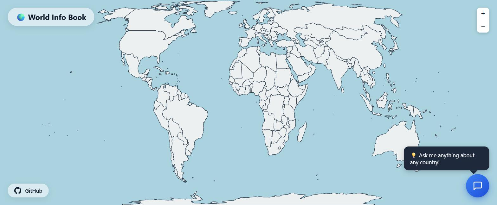
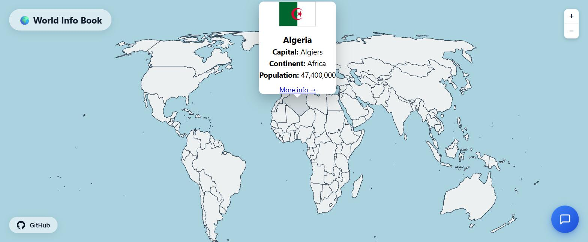
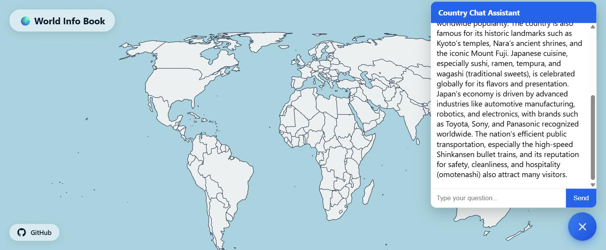
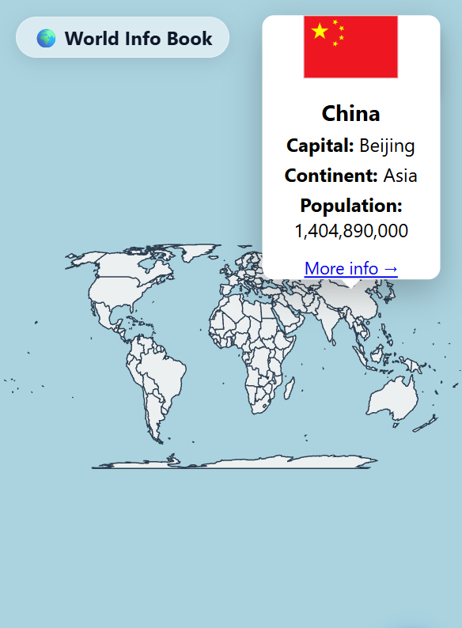

# 🌍 World Info Book

An interactive, AI‑powered world map that lets you explore country data at a glance – and ask questions about any country.



---

## 🚀 Live Demo

**[World Info Book – Live on Vercel](https://world-info-book.vercel.app)**  

---

## 📖 What It Does & The Problem It Solves

**World Info Book** is a full‑screen interactive map that displays key information about every country – population, capital, continent, and flag – directly in popups when you click on a country.

**The problem:** Maps show where countries are, but getting basic facts usually requires a separate search, opening multiple tabs, or remembering which source has the most reliable data.

**The solution:** We’ve eliminated that friction by embedding country data directly into the map, combined with a built‑in AI assistant that answers deeper questions without leaving the page.

**Who it’s for:** Anyone who wants to explore the world – students, travellers, educators, or just the curious – with an intuitive, visual interface.

---

## ✨ Features

- **Interactive world map** – pan, zoom (mouse, trackpad, or touch), and click any country.
- **Equal Earth projection** – renders country borders as vector shapes with d3-geo instead of a Mercator‑projected raster basemap, so landmass sizes stay proportionally accurate (no more Greenland‑sized‑as‑Africa distortion).
- **258 countries and territories** – including small island nations and micro‑states (Cape Verde, Vatican City, Tuvalu, etc.) that many world‑map datasets leave out.
- **Detailed country popups** – show flag, capital, continent, and population (formatted with commas); stay anchored to the country as you pan/zoom, and clamp to the screen edge on narrow viewports.
- **Britannica integration** – “More info” link searches Britannica for the country.
- **AI chatbot assistant** – ask questions about any country; get real‑time, streaming answers.
- **Glass‑morphism UI** – a sleek, translucent title badge and responsive design.
- **Chat tooltip** – gentle onboarding for first‑time users (auto‑fades after 5 seconds).
- **Globe favicon** – a simple emoji‑based icon for your browser tab.
- **Full‑screen, immersive map** – drawn on a `<canvas>` with [D3.js](https://d3js.org/), no basemap tile imagery, so panning and pinch‑zooming stay smooth on phones.
- **Responsive design** – works on desktop, tablet, and mobile, with proper touch support for pan/pinch‑zoom.
- **Android app** – the same app is packaged for the Google Play Store (see [Android App](#-android-app-google-play) below); the website stays available as before.

---

## 🤖 AI Chatbot Integration

The chatbot is a custom AI assistant built to answer country‑related questions. It can provide historical context, cultural insights, demographic details, and more.

### Basic System Prompt (what the AI is instructed to do)
```text
You are a helpful country facts assistant. Respond in clear, plain text. Do not use Markdown, asterisks, underscores, or hashes for formatting. Use simple line breaks to separate paragraphs.
```

### How it works
1. User types a question in the chat panel.
2. The question is sent to the backend (`/api/chat`).
3. The backend calls the **Groq API** (using the `openai/gpt-oss-120b` model).
4. The AI generates a response in plain text.
5. The response streams back to the frontend in real‑time.
6. The user sees the response appear word‑by‑word.

---

## 🛠️ Tools, Services & AI Models

| Category | Technology |
|----------|------------|
| **Map** | [D3.js](https://d3js.org/) (`d3-geo` + `d3-zoom`) – canvas rendering with an Equal Earth projection (trimmed D3 bundle served locally from `vendor/d3.min.js`) |
| **Country Data** | [REST Countries API v5](https://restcountries.com/) |
| **AI Chat** | [Groq](https://groq.com/) (model: `openai/gpt-oss-120b`) |
| **Hosting & Serverless** | [Vercel](https://vercel.com/) |
| **Fonts** | System UI stack (no external fonts) |
| **GeoJSON Data** | Locally‑hosted, [mapshaper](https://mapshaper.org/)‑simplified copy of [datasets/geo-countries](https://github.com/datasets/geo-countries) (Natural Earth derived, 258 features) — see `data/countries.geojson` |
| **Favicon** | Emoji‑based SVG data URI |
| **Version Control** | Git + GitHub |

---

## 📸 The App in Action - Screenshots







---

## 🏁 How to Run the Project

### Prerequisites
- [Node.js](https://nodejs.org/) (v16 or later)
- A [Vercel](https://vercel.com/) account (free tier is fine)
- API keys for:
  - [REST Countries](https://restcountries.com/sign-up) (free)
  - [Groq](https://console.groq.com/keys) (free)

---

### 1. Clone the Repository
```bash
git clone https://github.com/R21cF/world_info_book.git
cd world-info-book
```

### 2. Set Up Environment Variables
Create a `.env` file in the project root:

```env
REST_COUNTRIES_KEY=your_rest_countries_api_key
GROQ_API_KEY=your_groq_api_key
```

> **Note:** These keys are used by the Vercel serverless functions (`/api/countries.js` and `/api/chat.js`).

### 3. Install Vercel CLI (optional)
If you want to test locally:
```bash
npm install -g vercel
```

### 4. Run Locally
```bash
vercel dev
```

The app will be available at `http://localhost:3000`.

### 5. Deploy to Vercel
```bash
vercel --prod
```

Make sure to add your environment variables in the Vercel dashboard:
- Go to your project → **Settings** → **Environment Variables**.
- Add `REST_COUNTRIES_KEY` and `GROQ_API_KEY` with the values from your `.env` file.
- Select **Production** (and Preview/Development if needed).

---

## 🤖 Android App (Google Play)

The same web app is also packaged as a native Android app with [Capacitor](https://capacitorjs.com/). The app bundles the map files, so it opens instantly, and it calls the deployed API at `https://world-info-book.vercel.app` for country data and chat. The website keeps working exactly as before.

**App ID:** `io.github.r21cf.worldinfobook` (set in `capacitor.config.json` and `android/app/build.gradle`). It can't be changed after the first Play Store upload.

### One-time setup
1. Install [Android Studio](https://developer.android.com/studio) and the Android SDK (Platform 36, Build-Tools 35, Platform-Tools).
   - The build also needs **JDK 21**. Android Studio 2026.1 bundles Java 25, which the project's Gradle version can't run on. `android/gradle/gradle-daemon-jvm.properties` makes Gradle pick an installed JDK 21 automatically. The easiest place to put one is `%USERPROFILE%\.jdks` (Android Studio: *Settings → Build Tools → Gradle → Gradle JDK → Download JDK → version 21*).
2. Install the Capacitor tooling (from the project root):
   ```bash
   npm install
   ```
3. Create your **upload key** (keep the file and passwords safe and backed up; never commit them):
   ```bash
   "C:\Program Files\Android\Android Studio\jbr\bin\keytool" -genkeypair -v -keystore android/upload-keystore.jks -alias upload -keyalg RSA -keysize 2048 -validity 10000
   ```
4. Copy `android/keystore.properties.example` to `android/keystore.properties` and fill in the passwords you just chose.
5. Deploy the website (`vercel --prod`) so the live API includes the CORS headers the app needs.

### Build the Play Store bundle (.aab)
```bash
npm run android:sync     # copy the latest web files into the Android project
npm run android:open     # open it in Android Studio
```
In Android Studio:
- **Test:** plug in a phone with USB debugging enabled (or create an emulator) and press ▶ Run.
- **Release build:** run *Build → Generate Signed App Bundle / APK → Android App Bundle*. You can also run `npm run android:bundle` from a terminal where `JAVA_HOME` points to Android Studio's `jbr` folder.
- The bundle is written to `android/app/build/outputs/bundle/release/app-release.aab`.

### Publishing
1. Create a [Google Play Console](https://play.google.com/console) developer account (one-time $25 fee).
2. Create the app, then upload the `.aab` to a testing track first. New personal developer accounts must run a closed test before releasing to everyone; the Play Console shows the current requirements.
3. Fill in the store listing (use `android/store/play-icon-512.png` as the app icon, plus phone screenshots), the content rating questionnaire, and the **Data safety** form. Questions typed into the chat are sent to Groq to generate answers, and the store listing needs a privacy policy URL.

### Updating the app
- **API changes** (`api/`) go live for the app as soon as you deploy the website.
- **Map/UI changes** (HTML, CSS, JS, data) are bundled inside the app, so they need a new release. Bump `versionCode` (by 1) and `versionName` in `android/app/build.gradle`, run `npm run android:sync`, and build and upload a new bundle.

---

## 📁 Project Structure

```
world-info-book/
├── index.html          # Page markup
├── style.css           # All styles
├── js/
│   ├── map.js          # Canvas map (Equal Earth projection), zoom, and country popups
│   ├── chat.js         # Chat panel UI (streams replies from /api/chat)
│   └── config.js       # API base URL (same-origin on the web, live site in the app)
├── vendor/
│   └── d3.min.js       # Trimmed D3 bundle (only the modules the map needs)
├── data/
│   └── countries.geojson  # Locally-hosted country outlines (258 features)
├── api/
│   ├── chat.js         # AI chatbot endpoint (Groq)
│   ├── countries.js    # Country data proxy (REST Countries v5)
│   └── _cors.js        # CORS helper so the Android app can call the API
├── android/            # Native Android project (Capacitor)
│   └── store/          # Play Store listing assets (512px icon)
├── capacitor.config.json # App ID, name, and web folder for Capacitor
├── package.json        # Capacitor tooling + Android build scripts
├── scripts/
│   └── build-web.mjs   # Copies the site into www/ for the app build
├── .env                # Environment variables (ignored by Git)
├── .env.local          # Ignored by Git as well
└── .gitignore          # For telling Git to ignore files
```

---

## 🙌 Acknowledgements

- [D3.js](https://d3js.org/) for the mapping and projection library.
- [Twemoji](https://github.com/jdecked/twemoji) for the globe used in the Android app icon and splash screen (CC-BY 4.0).
- [datasets/geo-countries](https://github.com/datasets/geo-countries) and [Natural Earth](https://www.naturalearthdata.com/) for the country outline data.
- [REST Countries](https://restcountries.com/) for the country data API.
- [Groq](https://groq.com/) for the fast AI inference.
- [Vercel](https://vercel.com/) for seamless hosting and serverless functions.

---

## 📄 License

This project is open source and available under the [MIT License](LICENSE).

---

## 🤝 Contributing

Contributions are welcome! If you find a bug or want to suggest an improvement, please open an issue or submit a pull request.

---

**Built with curiosity.** 🌍
